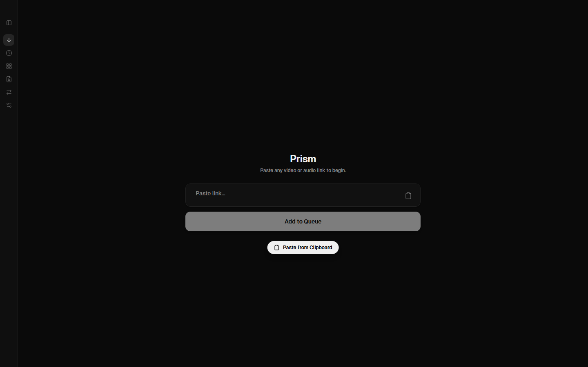
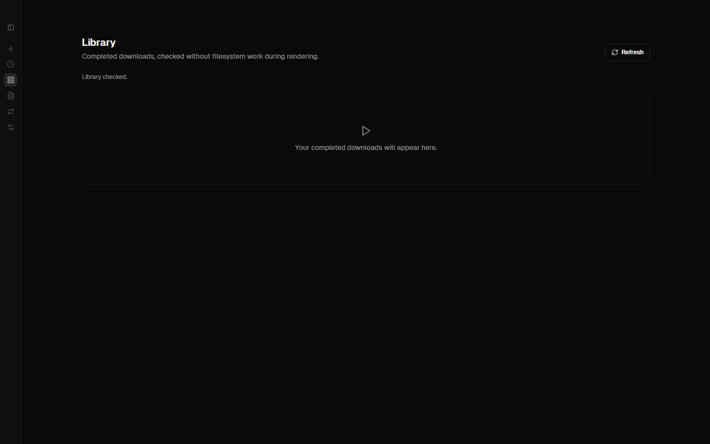
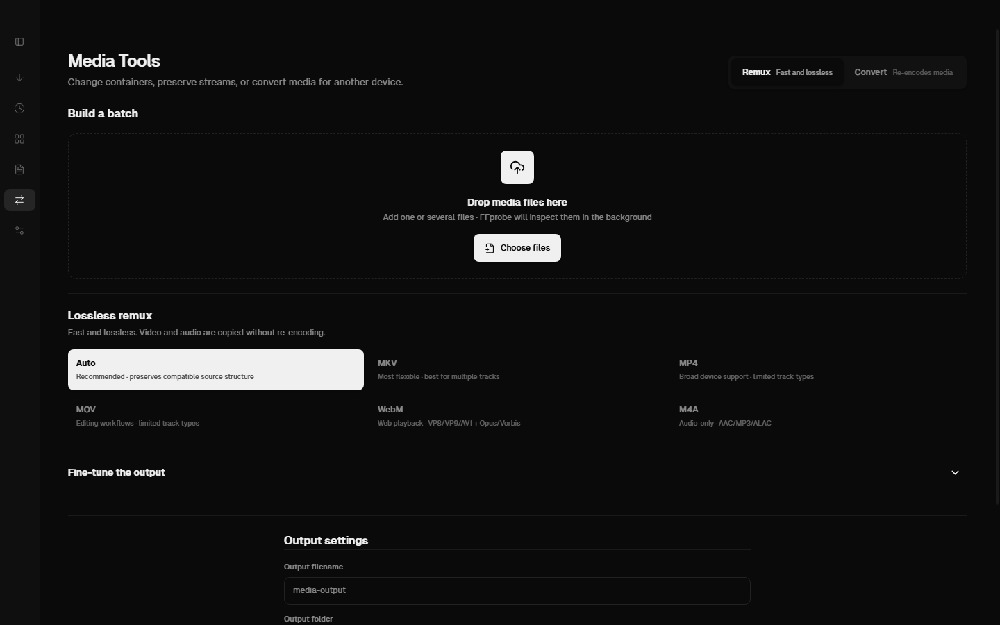
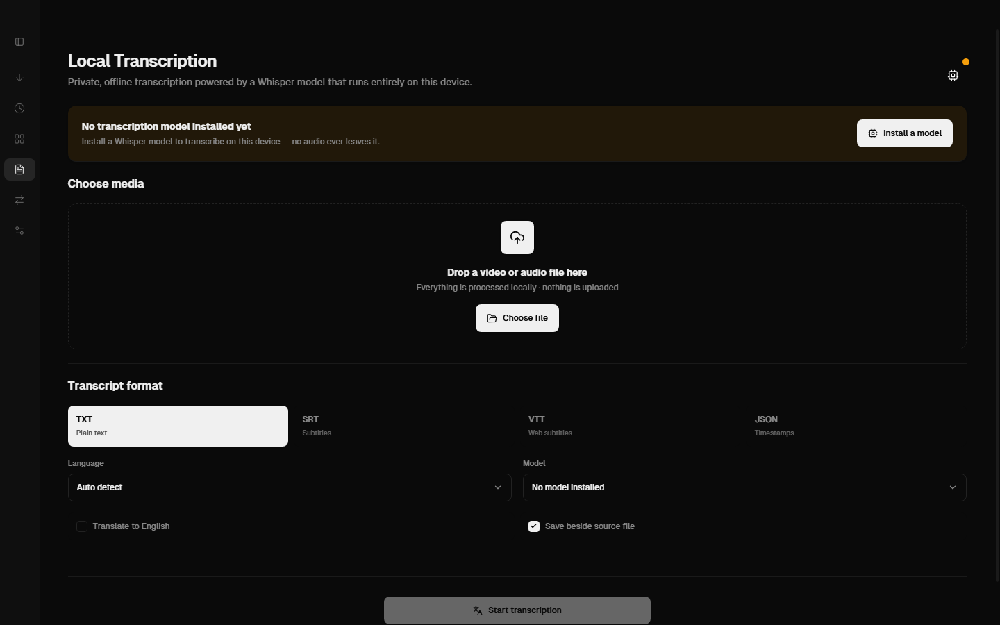

<div align="center">
  
  <h1>Prism</h1>
  <p><strong>A private Windows workspace for downloading, shaping, organizing, and transcribing media.</strong></p>
  <p>
    <a href="https://github.com/clivingston33/prism/actions/workflows/ci.yml"></a>
    <a href="https://github.com/clivingston33/prism/releases/tag/v0.1.0-alpha.1"></a>
    
    <a href="LICENSE"></a>
  </p>
</div>

<p align="center">
  
</p>

Prism brings the practical parts of a download manager, remuxer, converter,
media library, and local transcription tool into one focused desktop app. It
uses yt-dlp, FFmpeg, FFprobe, and whisper.cpp while keeping your media,
transcripts, settings, and history on your computer.

> [!WARNING]
> Prism is currently a **Windows 10/11 x64 public alpha**. The installer is
> intentionally unsigned, so Windows SmartScreen may warn or block it. Download
> the checksum file from the release and verify it before running the installer.

## Get Prism

Download **[Prism v0.1.0-alpha.1](https://github.com/clivingston33/prism/releases/tag/v0.1.0-alpha.1)**.

The release includes the Windows installer, updater metadata, a blockmap, and:

- `SHA256SUMS-windows.txt` for checksum verification
- `SIGNING-STATUS.txt` documenting the unsigned build

## The workspace

| Download                                                                                                                             | Shape media                                                                                        |
| ------------------------------------------------------------------------------------------------------------------------------------ | -------------------------------------------------------------------------------------------------- |
| Paste a supported site URL or direct media link. Choose quality, container, audio tracks, subtitles, and trim ranges before queuing. | Remux streams without re-encoding, or explicitly convert when another device or workflow needs it. |

| Organize                                                                                                       | Transcribe                                                                           |
| -------------------------------------------------------------------------------------------------------------- | ------------------------------------------------------------------------------------ |
| Keep completed files in a searchable row-based Library with filters, recovery tools, and download diagnostics. | Run Whisper locally with waveform range selection and TXT, SRT, VTT, or JSON export. |

## Screenshots

<table>
  <tr>
    <td width="50%"></td>
    <td width="50%"></td>
  </tr>
  <tr>
    <td align="center"><strong>Download</strong><br />Queue links, inspect formats, and preserve the source when possible.</td>
    <td align="center"><strong>Library</strong><br />Search completed media without thumbnail-heavy cards.</td>
  </tr>
  <tr>
    <td width="50%"></td>
    <td width="50%"></td>
  </tr>
  <tr>
    <td align="center"><strong>Media Tools</strong><br />Inspect tracks and build lossless remux or conversion batches.</td>
    <td align="center"><strong>Local Transcription</strong><br />Install a model and keep audio processing offline.</td>
  </tr>
</table>

## Why Prism

- **Source-aware downloads** - honest format and container reporting, quality limits, resumable jobs, conflict handling, disk-space preflight, and per-job diagnostics.
- **Track control** - select audio and subtitle languages, preserve defaults and forced captions, embed subtitles when supported, or save sidecars.
- **Lossless by default** - remuxing copies compatible streams; conversion is explicit when re-encoding is actually needed.
- **Private transcription** - Whisper models run locally. No cloud transcription or telemetry is included.
- **Built for real media work** - useful for Jellyfin libraries, editing scene packs, social clips, and personal archives.

## Supported sources

Prism uses yt-dlp's extractors, so YouTube, TikTok, X/Twitter, Instagram, direct
media URLs, and other sources may work when yt-dlp supports them. Site behavior,
authentication requirements, rate limits, and available captions can change.
Prism does not bypass DRM or guarantee every yt-dlp-supported site.

## Installation

1. Open the [alpha release](https://github.com/clivingston33/prism/releases/tag/v0.1.0-alpha.1).
2. Download the installer and `SHA256SUMS-windows.txt`.
3. Verify the installer's SHA-256 value.
4. Run the installer and allow Windows SmartScreen only if the checksum matches.

Prism keeps models, settings, history, and application data in the per-user
application-data directory. Your downloads and transcripts remain wherever you
choose to save them.

Read the [known limitations](docs/KNOWN_LIMITATIONS.md), [privacy notes](docs/PRIVACY.md),
and [security policy](SECURITY.md) before using the alpha.

## Development

Prerequisites:

- Node.js 22 or newer
- pnpm 9
- Windows x64 native resources for FFmpeg, FFprobe, yt-dlp, and whisper.cpp

```sh
git clone https://github.com/clivingston33/prism.git
cd prism
pnpm install --frozen-lockfile
pnpm dev
```

Useful commands:

| Command                   | Purpose                                                |
| ------------------------- | ------------------------------------------------------ |
| `pnpm dev`                | Start the Electron development app                     |
| `pnpm format:check`       | Check formatting                                       |
| `pnpm lint`               | Run ESLint                                             |
| `pnpm typecheck`          | Type-check the app                                     |
| `pnpm test`               | Run deterministic tests                                |
| `pnpm test:e2e:native`    | Exercise native download and media pipelines           |
| `pnpm build:win`          | Build the unsigned Windows installer                   |
| `pnpm screenshots:readme` | Recapture the README screenshots from the unpacked app |

## Project notes

- [Release process](docs/RELEASING.md)
- [Known limitations](docs/KNOWN_LIMITATIONS.md)
- [Real-media testing guide](docs/REAL_MEDIA_TESTING.md)
- [Privacy](docs/PRIVACY.md)
- [Security policy](SECURITY.md)
- [Contributing](CONTRIBUTING.md)

Prism is MIT licensed. Integrated binaries, models, and dependencies have
their own notices in [THIRD_PARTY_NOTICES.md](THIRD_PARTY_NOTICES.md).
